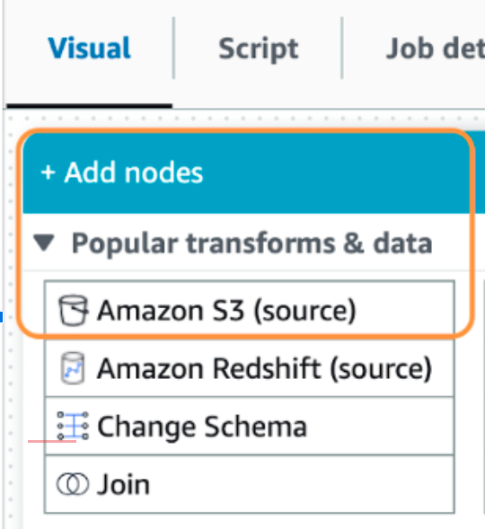
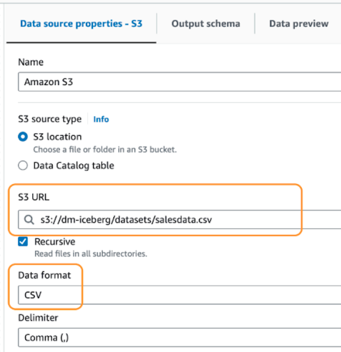

## Chapter 8 Resource

Before we start configuring the job, it is important to note that we will create the Iceberg table using an existing dataset stored in a S3 bucket. We will leverage the Create Table As Select (CTAS) command to create the table. So, as a first step, we will need to add a S3 source to our visual canvas. To do so, click on the “Add Node button” and select “Amazon S3 (source)” from the list.

Now, in the “Data Source Properties”, add the location of the S3 bucket that stores the dataset and set the “Data Format” as CSV. 

